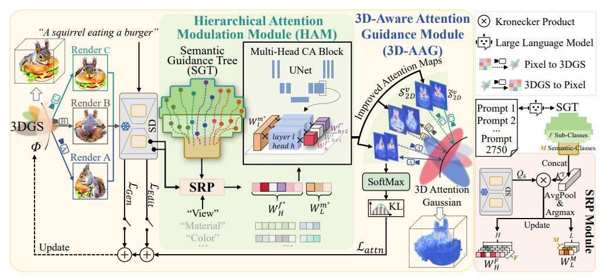








# 👀 About Me
Hello! I’m a second-year M.S. student at **Nanjing University of Information Science and Technology (NUIST)**, under the supervision of Prof. [Yuan Zhou](https://faculty.nuist.edu.cn/zhouyuan/zh_CN/zhym/43346/list/index.htm). I am closely working with [Haoran Duan](https://haoranduan.com/) in Tsinghua University. My research interests include **image and 3D generation**, **multimodal large models**, and **video understanding**.

# 🔥 News
- *2025.11*: &nbsp; 🎉🎉 Two papers are accepted to AAAI 2026
- *2025.04*: &nbsp; "Attention in diffusion models: A survey" is released on arXiv (under review).

# 📝 Publications  {#publications}

  

    

      

      

        AAAI
      

    

    

      <b style="font-size:17px;">ReaSon: Reinforced Causal Search with Information Bottleneck for Video Understanding</b> 
      Yuan Zhou (Supervisor), <b>Litao Hua</b>, Shilong Jin, Wentao Huang, Haoran Duan  

      AAAI'26. CCF-A  

      <a href="https://arxiv.org/abs/2511.12530" target="_blank">[Paper]</a>
      <a href="https://github.com/robin-hlt/AAAI26-ReaSon" target="_blank" style="margin-left:8px;">[Code]</a>
    

  

  

    

      

      

        AAAI
      

    

    

      <b style="font-size:17px;">
        Debiasing Diffusion Priors via 3D Attention for Consistent Gaussian Splatting
      </b> 

      Shilong Jin, Haoran Duan, <b>Litao Hua</b>, Wentao Huang, Yuan Zhou  

      AAAI'26. CCF-A  

      <a href="https://arxiv.org/abs/2512.07345" target="_blank">[Paper]</a>
      <a href="https://github.com/kimslong/AAAI26-TDAttn" target="_blank" style="margin-left:8px;">[Code]</a>
    

  

  

    

      

      

        arXiv
      

    

    

      <b style="font-size:17px;">ConsDreamer: Advancing Multi-View Consistency for Zero-Shot Text-to-3D Generation</b> 
      Yuan Zhou, Shilong Jin, <b>Litao Hua</b>, Wanjun Lv, Haoran Duan, Jungong Han  
      <a href="https://arxiv.org/abs/2504.02316" target="_blank">[Paper]</a>
      <a href="https://github.com/GAInuist/ConsDreamer" target="_blank" style="margin-left:8px;">[Code]</a>
    

  

  

    

      

      

        arXiv
      

    

    

      <b style="font-size:17px;">Attention in Diffusion Model: A Survey</b> 
      <b>Litao Hua</b>, Fan Liu, Jie Su, Xingyu Miao, Zizhou Ouyang, Zeyu Wang, Runze Hu,
      Zhenyu Wen, Bing Zhai, Yang Long, Haoran Duan, Yuan Zhou  
      <a href="https://arxiv.org/abs/2504.03738" target="_blank">[Paper]</a>
    

  

# 💼 Internships

  <!-- Shanghai AI Lab -->
  

    

      
    

    

      <b style="font-size:17px;">Shanghai AI Laboratory</b> 
      System Platform Center  
      
        Engineering Intern · Jan. 2026 – Present
       
      
        Embodied Intelligence · Reinforcement Learning Computing Framework
      
    

  

  <!-- Hikvision -->
  

    

      
    

    

      <b style="font-size:17px;">Hikvision</b> 
      
        Technical Intern · Feb. 2023 – May 2023
       
      
        Security System Deployment and Maintenance for Government and Universities
      
    

  

