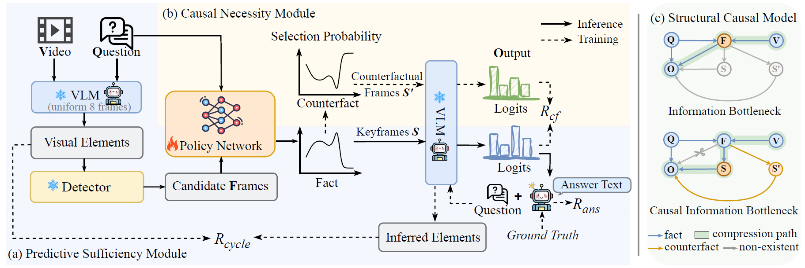
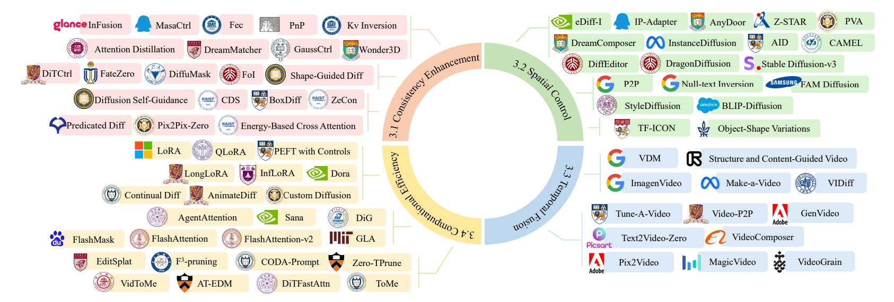
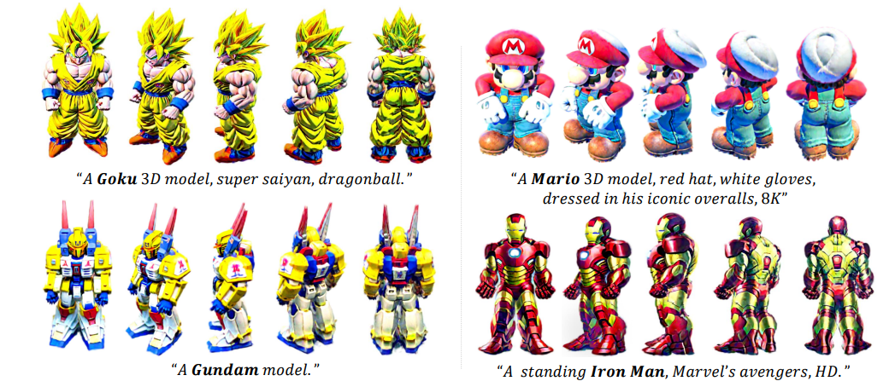








# 👀 About Me
Hello! I’m a second-year M.S. student at **Nanjing University of Information Science and Technology (NUIST)**, under the supervision of Prof. [Yuan Zhou](https://faculty.nuist.edu.cn/zhouyuan/zh_CN/zhym/43346/list/index.htm). I am closely working with [Haoran Duan](https://haoranduan.com/) in Tsinghua University. My research interests include **image and 3D generation**, **multimodal large models**, and **video understanding**.

# 🔥 News
- *2025.04*: &nbsp; 🎉🎉 Two papers are accepted to AAAI 2026
- *2025.04*: &nbsp; "Attention in diffusion models: A survey" is released on arXiv (under review).

# 📝 Publications  {#-publications}

  

    

      
      

      

        AAAI
      

    

    

      <b style="font-size:17px;">ReaSon: Reinforced Causal Search with Information Bottleneck for Video Understanding</b> 
      Yuan Zhou (Supervisor), <b>Litao Hua</b>, Shilong Jin, Wentao Huang, Haoran Duan  

      AAAI'26. CCF-A  

      <a href="https://arxiv.org/abs/2511.12530" target="_blank">[Paper]</a>
      <a href="https://github.com/robin-hlt/AAAI26-ReaSon" target="_blank" style="margin-left:8px;">[Code]</a>
    

  

  

    

      
arXiv

      
    

  

  

[**Attention in Diffusion Model: A Survey**](https://arxiv.org/abs/2504.03738)

**Litao Hua**, Fan Liu, Jie Su, Xingyu Miao, Zizhou Ouyang, Zeyu Wang, Runze Hu, Zhenyu Wen, Bing Zhai, Yang Long, Haoran Duan, Yuan Zhou

- A unified taxonomy that categorises attention-related modifications into parts according to the structural components they affect.

 

  

    

      
arXiv

      
    

  

  

[**ConsDreamer: Advancing Multi-View Consistency for Zero-Shot Text-to-3D Generation**](https://arxiv.org/abs/2504.02316)

Yuan Zhou, Shilong Jin, **Litao Hua**, Wanjun Lv, Haoran Duan, Jungong Han

- We propose ConsDreamer, a novel framework that mitigates view bias by refining both the conditional and unconditional terms in the score distillation process.

 

